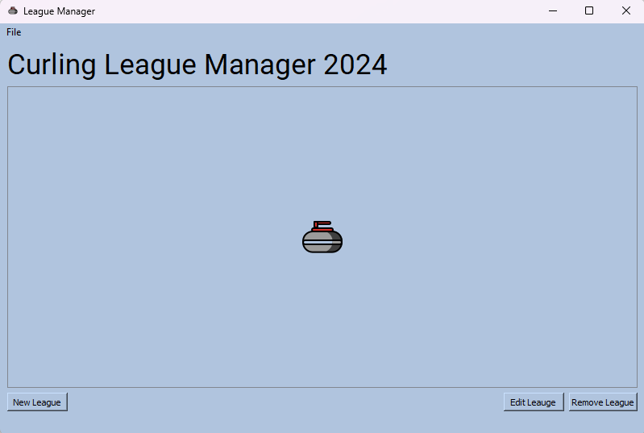
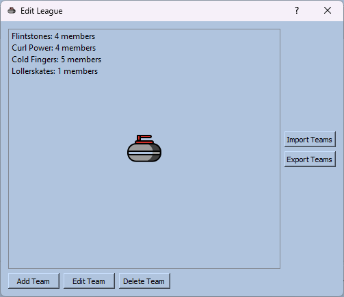
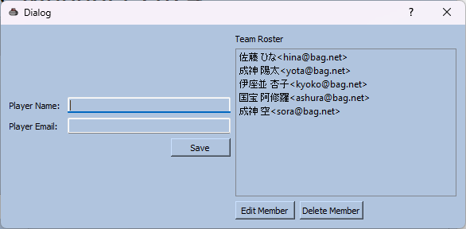

# LeagueGui

LeagueGui is a PyQt GUI created for use with the Curling League model.


## Installation

Install required packages via [pip](https://pip.pypa.io/en/stable/) prior to running the application.

```bash
pip install -r requirements.txt
```

If you already have the required packages, run "main_window.py" to start the 
GUI.

## Usage

LeagueGUI is designed to make managing your curling leauge database quick and easy through 
3 main windows.

1.) Main Window
-


- Add  a league
- Edit a league
- Delete a league
- Save/Load .ldb league database files

On the main window you will find a few options to manage leagues in your database.
Select "New League" to get started.  Leagues added to the database can also be edited or
deleted.  If you wish to save or restore an existing database you may do so from the File menu
at the top of this window.

2.) League Editor
-


- Add a team
- Edit a team
- Delete a team
- Import/Export team list from .csv

In the league editor window you can add, edit or remove teams from the selected league. 
If you have .csv file containing a list of teams you can import them here as well.  

3.) Team Editor
-


- Add a team member
- Edit a team member
- Remove a team member

In the team editor window you can add,edit and remove team members. To create a new team member
just enter in their information and click the "Save" button.  To edit a member select them from the list,
and then hit edit. Correct the loaded information to your liking and then save the member again.  This will
update their roster information.  Team members can also be removed by selecting them from the roster
and clicking "Delete Member"

4.) Bugs
-
- No data restored when loading a pickled .ldb file containing
a league_database instance.
